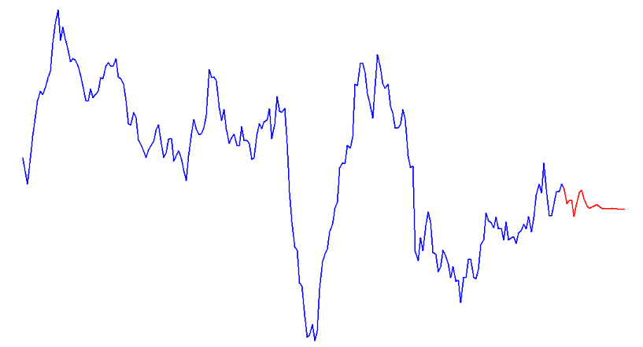

# Advanced Data Analysis with R

## Comparative Time Series Analysis of Inflation and Unemployment Rates in Spain, Germany, and Portugal

## Overview
This repository contains data analysis with R that is focused on exploring time series data related to inflation rates and unemployment rates across different countries, with a particular emphasis on Germany, Spain, and Portugal. The study aims to understand trends, seasonality, and the impact of different economic factors on these rates.

  

## Data Description
The project utilizes two primary datasets: 
- `inflation_rate_cpi.csv`: Contains Consumer Price Index (CPI) based inflation rate data.
- `unemployment_rate.csv`: Contains unemployment rate data

## Methodology

### Data Collection:

- Gathered monthly inflation and unemployment data for Spain, Germany, and Portugal from 2000 to 2019.
- Gathered the data from reliable source: https://www.theglobaleconomy.com/ 

### Descriptive Analysis:

- Conducted descriptive statistical analysis for each time series dataset.
- Created histograms to visualize the data distribution.

### Time Series Decomposition:
- Decomposed each time series to identify trends, seasonality, and residuals.
- Plotted the decomposed series for visual analysis.

### Transformation and Stationarity:
- Checked the necessity of Box-Cox transformation and applied where needed.
- Used ADF and KPSS tests to assess stationarity.
- Employed differencing (first-order for inflation, second-order for unemployment) to achieve stationarity.

### Model Fitting:
- Generated ACF and PACF plots to identify model parameters.
- Fitted two different models based on the ACF and PACF analysis.
- Compared models using AIC and BIC values to select the best fit.

### Forecasting and Evaluation:
- Divided the dataset into training (2000-2017) and testing (2018-2019) sets.
- Conducted forecasting on the testing dataset.
- Calculated evaluation metrics and plotted forecasted values.

### Residual Analysis
- Performed the Ljung-Box test on the residuals to check for randomness.

### Libraries Used
The following R libraries are used in this analysis:
- `dplyr`
- `lubridate`
- `tsibble`
- `forecast`
- `urca`
- `tseries`
- `ggplot2`

Ensure these are installed to run the R Markdown file successfully.

## Potential Applications and Significance

- Economic Policy Guidance: The findings can assist in shaping economic policies by understanding the dynamics of inflation and unemployment.
- Investment Decisions: Investors can use the insights for making informed decisions in financial markets.
- Academic Research: Contributes to the body of knowledge in macroeconomic time series analysis.

## Conclusion and Future WOrk

### Summary of Findings:

### Inflation Rate Insights:

Portugal's inflation rate from 2000 to 2019 fluctuated between -1.665% and 5.117%, indicating a moderately stable economy with instances of both deflation and modest inflation. The deflation periods might relate to economic downturns, such as the European debt crisis, while higher inflation could reflect recovery phases or pre-2008 growth. These trends mirror broader EU economic cycles during this time.

### Unemployment Rate Insights:

The unemployment rate in Portugal showed more variation, ranging from 5.0% to 18.2%. The peak unemployment rate aligns with the EU debt crisis's impact, highlighting cost-cutting measures and economic contraction. Lower rates suggest stable periods, likely in the early 2000s or post-crisis recovery. Overall, the data reflects Portugal's struggle with joblessness, influenced by regional policies and economic events within the EU.

### Comparative Analysis:

In this comprehensive analysis of inflation and unemployment rates for Spain, Germany, and Portugal from 2000 to 2019, several key steps were taken to understand and forecast these economic indicators. Initially, the Box-Cox transformation was applied to all unemployment series and the inflation series for Portugal to stabilize variance. Stationarity was then confirmed for each series using the ADF and KPSS tests, with first-order differencing sufficing for the inflation series and second-order differencing necessary for the unemployment rates.

The forecasting models were selected based on their ACF and PACF plots, with the best models chosen according to their AIC and BIC scores. The evaluation metrics for these models presented varied results across countries and economic indicators. For Germany, the models showed moderate accuracy in predicting inflation rates but performed better with unemployment rates. Spain's models exhibited less precision in forecasting both inflation and unemployment rates, as indicated by higher error metrics. Portugal's models demonstrated significant challenges in accurately forecasting both inflation and unemployment rates, with particularly high Mean Absolute Percentage Errors (MAPE) for inflation.

The Ljung-Box test results indicated that the residuals in all models were white noise, as all p-values were above 0.05. This suggests that the models captured the information in the data without leaving significant patterns in the residuals.

Overall, these results illuminate the complex and diverse nature of economic trends in these countries. The differences in the accuracy of forecasts between countries and economic indicators highlight the unique economic dynamics and challenges faced by each nation. While the models provided valuable insights, the high error rates, especially in the forecasts for Portugal, suggest that external factors or structural changes in these economies might be influencing the indicators in ways that are challenging to capture fully in the models used.

## Future Directions:

- Explore causality relationships between inflation and unemployment.
- Extend the study to include more macroeconomic variables like GDP growth, interest rates.
- Update the analysis with more recent data post-2019 for current insights.
